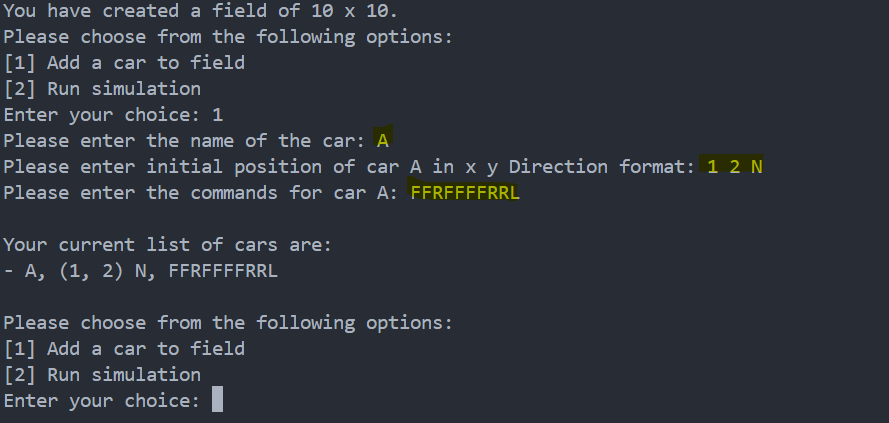
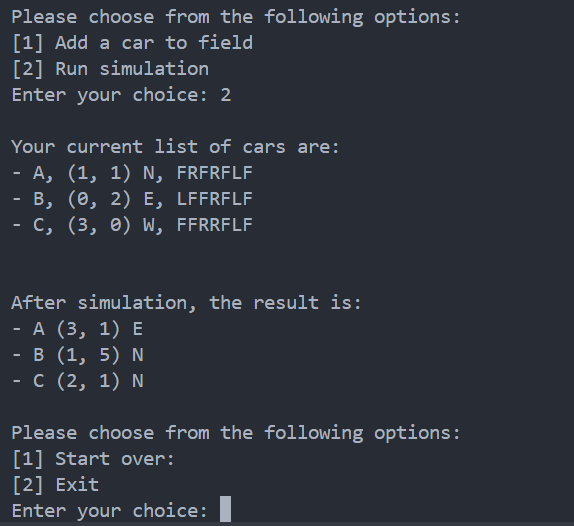
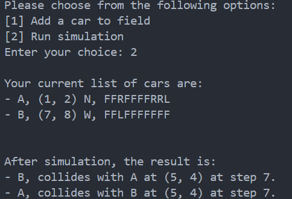

# Auto-Driving System

## Introduction

**Purpose of the System**: The Auto-Driving System aims to simulate the movement of autonomous cars within a defined field.

**Scope of the System**:

* Define a field with given width and height dimensions;
* Add car to the field with name, position and movement commands;
* Run a simulation where cars move according to commands while within the field bounds and avoiding collisions;
* Display results after the simulation.

## System Overview

##### Key Components

* **Field Class**: Represents the simulation space.
  * Key attributes: height, weight and a list of cars
* **Car Class**: Defines a car and its behaviour.
  * Key attributes: name, coordinate position, facing direction and a list of movement commands
* **Simulation Logic**: Controls cars movement in sequence and handles collision.

##### System Variables & Constraints

* **Field Width & Height**: The field size is deifned as two positive integers.
* **Boundary Handling**: Car's movement are restricted within the defined field.
* **Car Positioning**: A car's position is represented as `x, y, D`, where x is car's x-coordinate, y is car's y-coordinate and D is car's facing direction. D's value is one of `{N, S, E, W}`.
* **Movement Commands**: Each car follows a sequence of commands consisting of `L, R, F`.

## Guideline for Running the Simulation

##### Step 0: Preview user interaction flow

1. Input field size (width and heigh)
2. Add cars by specifying position, direction and commands
3. Run simulation
4. View results (final positions or collision)
5. Choose to restart or exit

##### Step 1: Start the Program

Open a terminal and run:

```
python main.py
```

The program will prompt you to enter input via the shell.

##### Step 2: Enter Field Size

Input the field dimensions in the format: `10 10`


This creates a 10x10 field where cars can operate.

##### Step 3: Add Cars

After creating field, the program will prompt you to choose either [1] Add a car to field, or [2] Run simulation.

Select 1 to add a car to the field:



* Position format: `x y D` (e.g., `1 2 N`)
* Valid Directions: `N `(North), `S `(South), `E `(East), `W `(West)
* Valid Commands: `L `(Turn Left), `R `(Turn Right), `F `(Move Forward)

##### Step 4. Run the Simulation

After adding cars, select 2 to run the simulation.

##### Step 5. View Results

The system will display final positions:



If a collision occurs, the system will report which cars collided and at which step:



##### Step 6. Restart or Exit

After the simulation ends, choose either [1] Start Over, or [2] Exit.

## Conclusion

The system effectively simulates car movements with collision detection. For future improvement, we may consider including a better UI, additional commands (e.g., B - move backward) and enhanced logging.
